 

<strong><a href="https://drive.google.com/file/d/1yPzNHgfFBomMX2AqVchLHCYkBuQ_oyhK/view?usp=sharing">Resume</a></strong>
&nbsp;·&nbsp;
<a href="https://www.linkedin.com/in/mahmoudnagiubb/">LinkedIn</a>
&nbsp;·&nbsp;
<a href="mailto:mahmoud.nagib09@gmail.com">Email</a>
 

---

## 👋 About

I am a **Computer Software Engineering student at the Egyptian Chinese University** building practical AI-enabled systems—not isolated notebooks or tutorial clones.

My strongest work sits where **AI, backend engineering, user-facing products, and real-world systems** meet: bilingual voice assistants, grounded retrieval, geospatial intelligence, scheduling automation, mobile applications, and robot integration.

| Snapshot | Details |
|---|---|
| **Education** | B.S. Computer Software Engineering · GPA **3.87 / 4.00** · Expected June 2028 |
| **Current role** | AI Team Lead · INNOVATRONICS ECU Research Club |
| **Target roles** | AI/ML Engineering · AI Software Systems · Backend Engineering Internships |
| **Location** | Cairo · Remote |

---

## 🚀 Selected Engineering Systems

<table>
<tr>
<td width="50%" valign="top">

<h3>🤖 INNO — Intelligent Campus Guide Robot</h3>

A bilingual, voice-first campus assistant connecting wake-word detection, streaming STT, grounded campus retrieval, TTS, session management, and validated robot-navigation commands on Raspberry Pi.

**Engineering signal:** AI that operates inside a physical product with failure states, latency constraints, and a safety boundary between language output and robot action.

`Python` `Voice AI` `RAG` `SQLite/FTS5` `Raspberry Pi` `MQTT`

**Team recognition:** 1st Place Overall at the Made in ECU Competition.

[Explore the repository →](https://github.com/MahmoudNagiubX/Intelligent-Campus-Guide-Robot)

</td>
<td width="50%" valign="top">

<h3>🌦️ Geo Weather — Smart City Intelligence</h3>

A deployed geospatial AI dashboard for weather impact, urban heat risk, and emergency mobility in Nasr City, Cairo—combining open data, feature engineering, routing, explainability, APIs, and an interactive map.

**Engineering signal:** a full-stack decision-support product that moves from geospatial pipelines and model artifacts to a public live application.

`FastAPI` `React` `TypeScript` `MapLibre` `GeoPandas` `Docker`

**Verified checks:** 146 backend tests + 43 frontend tests, with a passing production build.

[Live demo →](https://mahmoudnagiubx-geoweather.hf.space/) · [Repository →](https://github.com/MahmoudNagiubX/Egypt-Smart-City-Digital-Twin)

</td>
</tr>

<tr>
<td width="50%" valign="top">

<h3>🌌 Smart Life Planner</h3>

A Flutter + FastAPI personal planning system combining tasks, notes, habits, focus, reminders, voice capture, authentication, and spiritual planning in one mobile experience.

Its **H-ASAE engine** uses deterministic scoring, overload detection, prayer-aware constraints, and user-confirmed scheduling rather than hiding planning decisions behind an opaque model.

`Flutter` `FastAPI` `PostgreSQL` `Riverpod` `Groq` `Whisper`

[Explore the repository →](https://github.com/MahmoudNagiubX/Smart-Life-Planner)

</td>
<td width="50%" valign="top">

<h3>🩺 Multi-Disease Detection System</h3>

An end-to-end educational medical-AI prototype combining cardiovascular risk estimation, four-class brain MRI classification, authenticated Flask workflows, patient-scoped history, PDF reporting, and a contextual LLM assistant.

**Signal:** connects ML and CNN inference to validation, service boundaries, persistence, reporting, and responsible communication of model limits.

`Python` `Flask` `scikit-learn` `TensorFlow` `SQLite` `Groq`

Educational prototype · Not a clinical diagnostic tool

[Explore the repository →](https://github.com/MahmoudNagiubX/Multi-Disease-Detection-System)

</td>
</tr>
</table>

---

## 🧠 Engineering Approach

`LISTEN` → `GROUND` → `REASON` → `PLAN` → `ACT` → `VERIFY`

| Principle | How it appears in my projects |
|---|---|
| **Ground before generating** | RAG and structured data are preferred over unsupported model memory. |
| **Separate intelligence from action** | AI outputs pass through validation boundaries before navigation, persistence, or scheduling. |
| **Design for failure** | Retries, fallbacks, health checks, session recovery, and explicit error states are part of the product. |
| **Build the complete path** | I connect models and algorithms to APIs, databases, interfaces, tests, and deployment. |
| **Explain decisions** | Risk drivers, scheduling scores, confidence, and route reasoning are made visible where possible. |

---

## 🧰 Core Engineering Stack

<table>
<tr>
<td width="33%" valign="top">

### 🧠 AI & Data

- Python
- scikit-learn
- TensorFlow & PyTorch
- RAG and LLM integration
- NLP and voice pipelines
- Computer vision foundations
- Pandas, NumPy, GeoPandas

</td>
<td width="33%" valign="top">

### ⚙️ Backend & Reliability

- FastAPI and Flask
- REST API design
- PostgreSQL and SQLite
- SQLAlchemy and Alembic
- Authentication and validation
- pytest and integration testing
- Docker, Linux, GitHub Actions

</td>
<td width="33%" valign="top">

### 📱 Product & Edge

- Flutter and Riverpod
- React and TypeScript
- MapLibre and geospatial UI
- Raspberry Pi
- MQTT and WebSocket
- Audio/STT/TTS integration
- C++ and real-time systems

</td>
</tr>
</table>

---

## 🧩 More Engineering Work

- **[Super Mango Game](https://github.com/MahmoudNagiubX/Super-Mango-Game)** — C++/raylib project focused on modular game architecture, entity systems, state management, and resource ownership.
- **[Space Invaders Game](https://github.com/MahmoudNagiubX/Space-Invaders-Game)** — real-time C++ OOP game with collisions, destructible shields, persistent high scores, and a packaged Windows release workflow.

---

## 🟡 Contribution Arcade

  <picture>
    <source media="(prefers-color-scheme: dark)" srcset="https://raw.githubusercontent.com/MahmoudNagiubX/MahmoudNagiubX/output/pacman-contribution-graph-dark.svg">
    <source media="(prefers-color-scheme: light)" srcset="https://raw.githubusercontent.com/MahmoudNagiubX/MahmoudNagiubX/output/pacman-contribution-graph.svg">
    
  </picture>

---

### Let the projects do the talking.

<a href="https://drive.google.com/file/d/1yPzNHgfFBomMX2AqVchLHCYkBuQ_oyhK/view?usp=sharing"><strong>Resume</strong></a>
&nbsp;·&nbsp;
<a href="https://www.linkedin.com/in/mahmoudnagiubb/"><strong>LinkedIn</strong></a>
&nbsp;·&nbsp;
<a href="mailto:mahmoud.nagib09@gmail.com"><strong>Email</strong></a>

  

From prompts and data to APIs, interfaces, and physical systems.

